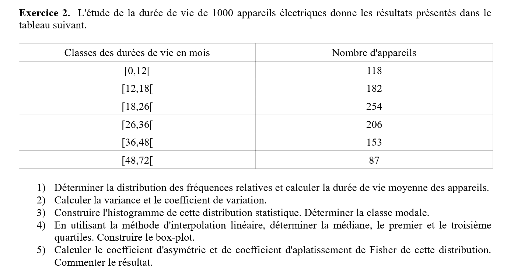

# StatAnalyser

### Exercice de Maths Utiliser Pour l'exemple

#### Description
Ce script Python est conçu pour analyser les données statistiques de durées de vie d'appareils électriques regroupées en classes. Il permet de calculer la distribution des fréquences relatives, la durée de vie moyenne, la variance, le coefficient de variation, et plus encore. Il offre également des fonctionnalités pour générer des histogrammes, des box-plots, et d'autres types de diagrammes pour visualiser les données.

#### Prérequis
- Python 3.x
- Bibliothèques Python : `matplotlib`, `numpy`, `kandinsky` (optionnelle, pour des interfaces graphiques spécifiques)

#### Comment utiliser le programme
1. **Lancer le programme** : Exécutez le script dans votre environnement Python.
2. **Entrer les données de base** : Le programme vous demandera d'entrer le total des observations, le nombre de classes, et un coefficient pour les calculs. Suivez les instructions à l'écran pour compléter ces informations.
3. **Remplir les classes** : Entrez les limites minimales et maximales de chaque classe, ainsi que le nombre d'observations (`ni`) pour chaque classe. Si nécessaire, entrez également la masse salariale pour des calculs spécifiques.
4. **Calculer les statistiques** : Après avoir rempli les classes, choisissez l'option pour calculer les statistiques descriptives. Le programme calculera et affichera la moyenne, la variance, les quartiles, etc.
5. **Vérifier les données** : Vous pouvez vérifier la cohérence des données saisies avant de procéder aux calculs.
6. **Afficher les formules** : Pour une compréhension approfondie des calculs effectués, consultez les formules utilisées par le programme.
7. **Générer des diagrammes** : Si les bibliothèques nécessaires sont installées, vous pouvez générer divers types de diagrammes pour visualiser les données.

#### Exemple d'utilisation
Supposons que vous ayez les données de durée de vie de 1000 appareils électriques réparties en différentes classes. Suivez les étapes du programme pour entrer ces données et calculer les statistiques requises par l'exercice.

1. Total des observations : 1000
2. Nombre de classes : 6
3. Coefficient : (à déterminer selon les besoins de l'exercice)

Pour chaque classe, entrez les limites et le nombre d'observations comme demandé par le programme. Ensuite, procédez aux calculs et à la génération des diagrammes si nécessaire.

---

Maintenant, passons à l'exercice que vous avez fourni. Veuillez me donner un moment pour préparer une explication étape par étape sur la façon d'utiliser votre programme pour résoudre cet exercice.

Pour résoudre l'exercice donné en utilisant votre programme, suivez les étapes ci-dessous. L'exercice demande d'analyser la durée de vie de 1000 appareils électriques répartis en différentes classes, de calculer la distribution des fréquences relatives, la durée de vie moyenne, la variance, le coefficient de variation, et de construire des histogrammes et des box-plots, entre autres analyses.

### Étape 1 : Préparation des Données
Avant de démarrer le programme, préparez vos données en fonction des classes de durée de vie données dans l'exercice :

- Classes des durées de vie en mois : [0,12[, [12,18[, [18,26[, [26,36[, [36,48[, [48,72[
- Nombre d'appareils par classe : 118, 182, 254, 206, 153, 87

### Étape 2 : Lancement du Programme et Saisie des Informations de Base
1. **Total des observations** : Entrez `1000` lorsque le programme demande le `total`.
2. **Nombre de classes** : Saisissez `6`, correspondant au nombre de classes fournies.
3. **Coefficient** : Le coefficient peut être utilisé pour ajuster la densité (hi) des classes. Si l'exercice ne spécifie pas de coefficient particulier, vous pouvez entrer `1` ou tout autre valeur que vous jugez appropriée pour les calculs de densité.

### Étape 3 : Remplissage des Classes
Le programme vous invitera à remplir les informations pour chaque classe. Entrez les limites minimales et maximales ainsi que le nombre d'appareils (`ni`) pour chaque classe, comme indiqué dans l'exercice.

### Étape 4 : Calcul des Statistiques
Après avoir rempli les données de toutes les classes, choisissez l'option pour calculer les statistiques. Le programme calculera :

- La distribution des fréquences relatives (fi)
- La durée de vie moyenne des appareils
- La variance et le coefficient de variation
- Les quartiles en utilisant l'interpolation linéaire
- Le coefficient d'asymétrie et le coefficient d'aplatissement de Fisher

### Étape 5 : Vérification et Affichage des Résultats
Vérifiez les données et les calculs. Utilisez les options fournies par le programme pour afficher les formules, vérifier la cohérence des données, et visualiser les résultats à travers des diagrammes.

### Exemple d'Utilisation
Pour la classe [0,12[ avec 118 appareils, lorsque le programme demande les limites et le nombre d'appareils, vous saisiriez :

- `min[0]?` : 0
- `max[0]?` : 12
- `n[0]:` : 118

Répétez ce processus pour toutes les classes en utilisant les données fournies dans l'exercice.

### Génération des Diagrammes
Si vous avez configuré les bibliothèques graphiques correctement, utilisez l'option de diagrammes pour générer l'histogramme et le box-plot demandés par l'exercice.